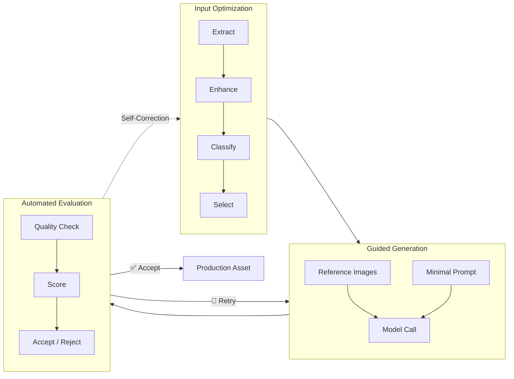
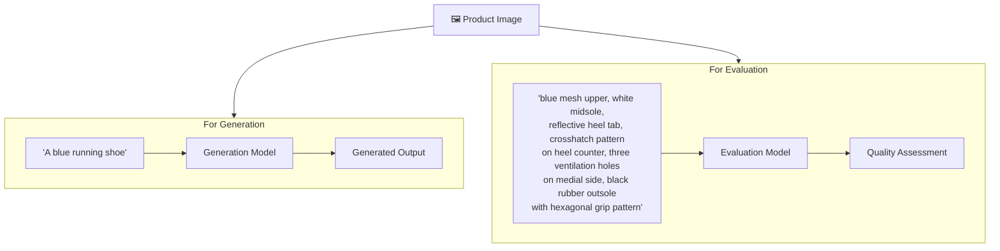
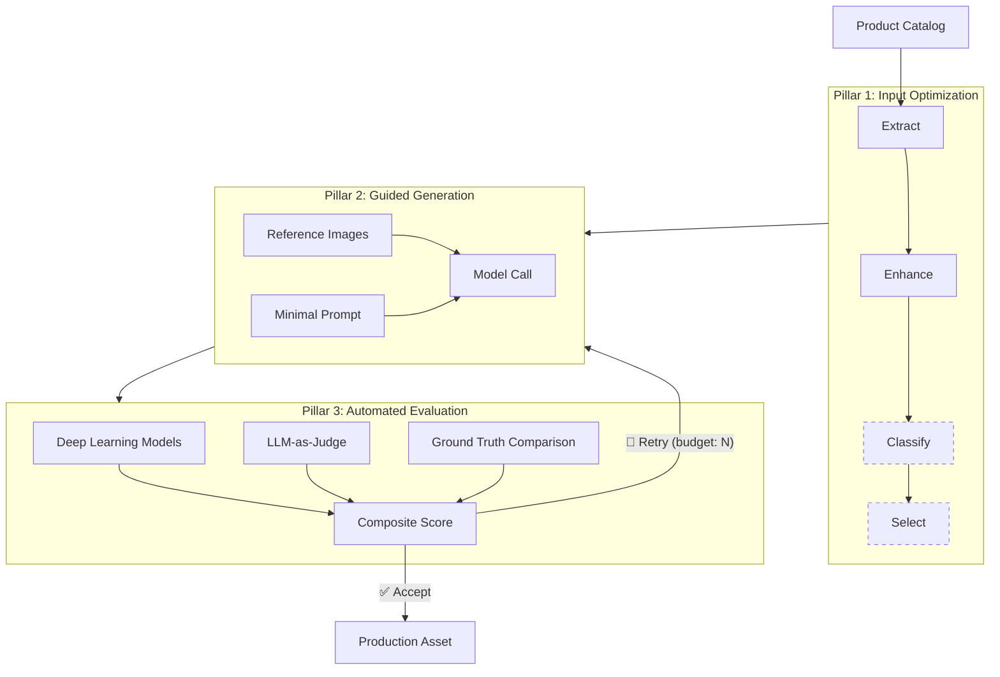

# Part 2: The Architecture Framework

> **[Back to Overview](genmedia_at_scale_main.md)** | **Previous: [Part 1 — Why GenMedia is Hard at Scale](genmedia_at_scale_why.md)**

---

## The Three Pillars

Every production-grade generative media pipeline is built on the same three-pillar framework. The pillars are sequential: optimize inputs, guide generation, evaluate outputs. But the system is a loop, not a line: failed evaluations trigger retries with the same optimized inputs, and in some cases evaluation results inform the next generation attempt.



---

## Pillar 1: Input Optimization

Input optimization is not a fixed sequence of steps. It's a **toolkit** — a set of techniques that are composed differently depending on the use case and the quality of available inputs.

### The Toolkit

| Technique | What It Does | When It's Used |
|-----------|-------------|----------------|
| **Extraction** | Isolates the subject from its background | Removes noisy backgrounds that confuse generation models |
| **Enhancement** | Upscales resolution, cleans artifacts | When input images are low-resolution or have compression artifacts |
| **Classification** | Identifies properties of the input (viewpoint, category, pose) | When the pipeline needs to route inputs, validate coverage, or filter unusable images |
| **Selection** | Chooses the best subset of inputs from available options | When multiple input images are available and quality/coverage varies |

> **Key Principle:** Input optimization is about reducing variance in what the model sees. The cleaner and more consistent the input, the less room the model has to improvise — and improvisation is the primary source of errors.

---

## Pillar 2: Guided Generation

The generation call itself is where many teams focus their effort — prompt engineering, parameter tuning, model selection. In this framework, generation is deliberately kept **simple and constrained**. The complexity lives in the pillars on either side.

### Reference Images Lead

For most generative media use cases, the reference images are the primary input. The model should reproduce what it sees in the images, not what it interprets from text.

> **Key Principle: Descriptions for generation should be minimal.** Let the images lead. A short, generic description ("A red ceramic mug") is sufficient to anchor the model. Detailed descriptions ("A red ceramic mug with a glossy finish, a curved handle on the right side, and a small chip near the base") risk conflicting with the visual reference — and when text conflicts with images, models often follow the text, introducing errors.

### The Role of Descriptions: Generation vs. Evaluation

This is perhaps the most counterintuitive insight in the framework:

**For generation:** Descriptions should be *minimal*. Just enough context for the model to understand the scene, not enough to override the visual references.

**For evaluation:** Descriptions should be *rich and detailed*. A thorough description of the product — materials, hardware, logos, structural details — provides the vocabulary for evaluation models to assess fidelity. "Does the generated image show the distinctive crosshatch pattern on the heel counter?" can only be asked if the evaluation knows about the crosshatch pattern.

This asymmetry is deliberate. Generation models work best when visually guided. Evaluation models work best when given explicit criteria to check against.



---

## Pillar 3: Automated Evaluation

Evaluation is the pillar that makes the framework production-grade. Without it, every output is a gamble. With it, the pipeline can achieve quality levels that approach or exceed human review.

The evaluation system is covered in depth in **[Part 3: Deep Dive on Evaluation](genmedia_at_scale_evaluation.md)**. Here, we outline the architectural role it plays.

### The Generate-Evaluate Loop

The core production loop is:

```
Generate → Evaluate → Accept or Retry
```

Each evaluation produces one of three outcomes:

| Outcome | Action |
|---------|--------|
| **Accept** | Output passes all quality gates — deliver to production |
| **Retry** | Output fails a quality gate — regenerate within the retry budget |
| **Discard** | Output fails hard quality floors — cannot be used regardless of score |

### Retry Budgets

Retries don't guarantee convergence — some inputs simply won't produce acceptable output. The framework enforces **retry budgets** that cap attempts and define what happens when the budget is exhausted: either use the best available result (best-effort) or exclude the product entirely (strict). The choice is a business decision that trades quality against cost and coverage.

### Evaluation Informs Generation

In advanced pipelines, evaluation doesn't just accept or reject — it **informs the next attempt**. If evaluation detects a specific deficiency in the output, it can trigger a targeted correction pass rather than a blind retry. This creates a multi-step self-correction loop:

```
Generate → Evaluate → Correct Specific Issue → Re-Evaluate → Pick Best Step
```

This pattern is more effective than retrying from scratch, because it builds on a partially-correct result and gives the model specific feedback about what went wrong.

---

## Putting It Together

The three pillars compose into a general-purpose framework that can be instantiated for any generative media use case:



What changes across use cases is the specific composition of techniques within each pillar — which is exactly what the case studies in Parts 4 and 5 demonstrate.

> **Next: [Part 3 — Deep Dive: Evaluation](genmedia_at_scale_evaluation.md)**
