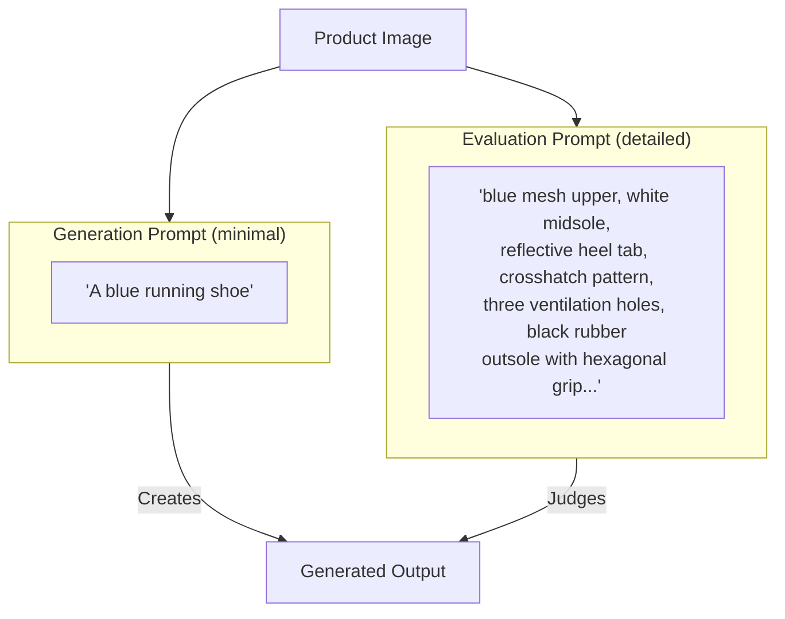
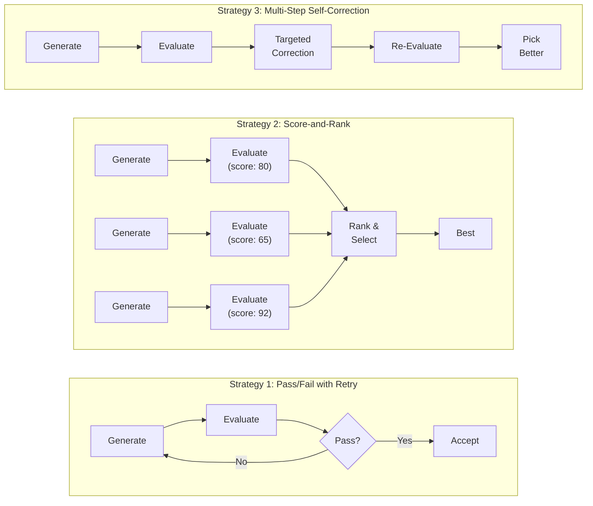

# Part 3: Deep Dive — Evaluation

> **[Back to Overview](genmedia_at_scale_main.md)** | **Previous: [Part 2 — The Architecture Framework](genmedia_at_scale_architecture.md)**

---

## Why Evaluation is the Hardest Part

Input optimization and guided generation are engineering challenges with known techniques. Evaluation is fundamentally harder because it requires the system to **judge quality** — a task that traditionally requires human perception.

The evaluation system must answer questions like:
- Does this generated video contain visual artifacts or discontinuities?
- Does this generated image faithfully reproduce the reference product?
- Has the model preserved identity, structure, and brand-specific details?

These questions span a spectrum from purely objective (rotation direction is measurable) to deeply subjective (does this "look right"?). The evaluation framework must handle the full spectrum.

The stakes are high. A false positive — accepting a bad generation — means a defective asset reaches the customer-facing catalog. A false negative — rejecting a good generation — means wasted compute and potentially failing to produce media for a product. The evaluation system needs to be both sensitive enough to catch real problems and robust enough to avoid rejecting acceptable output.

---

## Evaluation Method Types

The framework employs three categories of evaluation methods, each suited to different aspects of quality assessment.

### 1. Deterministic Deep Learning Models

**What:** Traditional deep learning and computer vision models that produce repeatable, objective measurements.

**When to use:** When the quality dimension can be quantified numerically — identity preservation, motion analysis, structural similarity.

**Applicable methods:**

| Method | What It Measures | Output |
|--------|------------------|--------|
| Face embedding similarity | Whether a generated face matches the reference person | Cosine similarity (0–100%) |
| Optical flow analysis | Motion direction, consistency, and anomalies in generated video | Classification + confidence |
| Structural similarity (SSIM) | Pixel-level similarity between reference and generated images | Similarity score (0–1) |

> **Key Advantage:** Deterministic models are fast, cheap (no API call), and reproducible. The same input always produces the same evaluation. They form the foundation of the evaluation stack and should be used as the first line of assessment before more expensive methods.

### 2. LLM-as-Judge with Gemini

**What:** Large vision-language models that analyze generated media and produce structured quality assessments.

**When to use:** When the quality dimension requires semantic understanding — detecting visual artifacts that break physical plausibility, assessing whether product details are accurately reproduced, identifying hallucinated features.

**Applicable methods:**

| Method | What It Measures | Output |
|--------|------------------|--------|
| Visual artifact detection | Glitches, discontinuities, unnatural transformations in generated media | `{is_valid: bool, explanation: str}` |
| Product accuracy scoring | Whether reference product details are faithfully reproduced | Score on a defined scale (e.g., 0–100) |
| Multi-view product consistency | Whether a generated video maintains consistent product appearance across frames and matches the reference | `{is_valid: bool, explanation: str}` |

**Visual artifact detection** sends generated media to Gemini and asks it to identify specific categories of problems: discontinuities, features appearing or disappearing, unnatural transformations. The prompt must be carefully calibrated to distinguish between actual defects and acceptable imperfections (minor wobbles, slight lighting variations, natural reflections).

**Product accuracy scoring** evaluates how faithfully a reference product is reproduced in the generated output. The scoring scale should be designed around **critical decision boundaries** — distinguishing between "completely wrong" (automatic discard), "present but imperfect" (usable with lower score), and "accurate reproduction" (high score).

**Multi-view ground truth comparison** is particularly powerful for consistency validation. Rather than checking individual outputs in isolation, it sends all reference images and matched generated outputs to Gemini in a single call, asking it to evaluate consistency across the entire set. This catches problems that single-view evaluation misses — like a product that looks correct from one angle but wrong from another.

> **Key Principle: Descriptions serve evaluation, not generation.** This is where rich, detailed product descriptions become valuable. While generation prompts should be minimal to avoid conflicts with reference images, evaluation prompts benefit from exhaustive descriptions. "Check whether the distinctive crosshatch pattern is present on the heel counter" requires knowing about the crosshatch pattern — and that knowledge comes from a detailed product description, not from the generation prompt.



---

## Evaluation Strategies

The method types above are combined into **strategies** — patterns for how evaluation results drive pipeline behavior.

### Strategy 1: Pass/Fail with Retry

**Pattern:** Generate → Evaluate → If fail, regenerate (up to N attempts)

**Best for:** Use cases where quality is binary — the output is either acceptable or it isn't.

Evaluations are **sequenced by cost:** cheap deterministic checks (local computation, no API call) run before expensive LLM evaluations. This saves money on obviously bad generations that can be caught without a Gemini call.

### Strategy 2: Score-and-Rank with Parallel Variations

**Pattern:** Generate N variations in parallel → Evaluate all → Select the best

**Best for:** Use cases where quality is a spectrum, and the best result among multiple attempts is desired.

This strategy trades compute cost for quality — generating N variations costs Nx but dramatically increases the probability of producing at least one excellent result. It also fundamentally changes the latency profile: parallel generation achieves quality improvement in 1x wall-clock time instead of Nx sequential retries.

### Strategy 3: Multi-Step Self-Correction

**Pattern:** Generate → Evaluate → Generate targeted correction → Re-evaluate → Pick best step

**Best for:** Use cases where specific, identifiable aspects of the generation can be corrected without starting from scratch.

Rather than discarding a partially-correct result and regenerating entirely, the pipeline detects the specific deficiency and triggers a correction pass. This is more efficient than blind retry because it builds on what was already correct and gives the model specific feedback about what went wrong.

### Combining Strategies

These strategies are not mutually exclusive — they can be composed. For example, a pipeline might generate N variations in parallel (Strategy 2), apply a targeted correction pass to each variation (Strategy 3), and then score-and-rank the results. Or a pass/fail retry loop (Strategy 1) might include a self-correction step before deciding to discard and regenerate from scratch. The right combination depends on the use case, the cost profile, and which quality dimensions are most likely to fail.



---

## Acceptance Thresholds and Composite Scoring

When multiple evaluation dimensions are assessed, they must be combined into a single actionable decision. The framework applies **acceptance thresholds** first, then **weighted composite scoring** on the survivors.

### Acceptance Thresholds

Before computing any composite score, each evaluation dimension is checked against a hard floor. If any single dimension falls below its acceptance threshold, the output is discarded immediately — regardless of how well it scores on other dimensions. This prevents critically flawed outputs from being masked by high scores elsewhere.

### Weighted Combination

Outputs that pass all acceptance thresholds are then scored. Multiple evaluation scores are combined with configurable weights that reflect business priorities:

```
final_score = dimension_1_score * weight_1 + dimension_2_score * weight_2 + ...
```

The weights encode what matters most for the specific use case. Adjusting weights shifts the quality tradeoff without changing the evaluation methods themselves.

---

## Retry Budgets and Cost/Quality Tradeoff

Every retry costs money — API credits, compute time, and latency. The framework makes the cost/quality tradeoff explicit through **retry budgets**.

### Cost-Aware Sequencing

Different evaluation methods have vastly different costs. The framework sequences evaluations from cheapest to most expensive:

| Cost Tier | Examples | When to Use |
|-----------|----------|-------------|
| Negligible | Embeddings, optical flow, SSIM | First — catch obvious failures for free |
| Low | LLM evaluation (Gemini) | Second — semantic checks on candidates that passed cheap checks |
| High | Regeneration (Veo, Gemini image generation) | Last resort — only when evaluation confirms the output is unacceptable |

This sequencing ensures that expensive regeneration only happens when cheap checks can't resolve the quality question.

### Budget Exhaustion

When the retry budget is exhausted, the pipeline must decide: use the best available result (best-effort) or exclude the product entirely (strict). This is a business decision that trades quality against catalog coverage. Both strategies are valid depending on the use case and quality requirements.

---

## Evaluation Calibration

Evaluation models — especially LLM-as-judge — require careful calibration to distinguish between real problems and acceptable imperfections.

### Strict vs. Lenient Criteria

Every evaluation prompt must define what constitutes a real defect versus an acceptable artifact:

| Strict (Must Be Correct) | Lenient (Can Vary) |
|--------------------------|-------------------|
| Product structure and features | Minor texture inconsistencies |
| Color accuracy | Slight lighting variations |
| Feature placement | Text legibility and spelling |
| Hallucinated or missing elements | Logo fine detail |

The distinction is critical. Being too strict produces excessive false rejections (wasted compute). Being too lenient lets defective assets through. Calibration is an iterative process informed by analyzing which kinds of imperfections actually impact the end-user experience.

> **Key Principle:** Text and logos in generated images should be treated as "visual blobs." Correct position and approximate color is sufficient; exact legibility is not required. Generative models struggle with text rendering, and holding them to a legibility standard would reject otherwise excellent outputs.

---

> **Next: [Part 4 — Case Study: Product 360 Spinning](genmedia_at_scale_spinning.md)**
