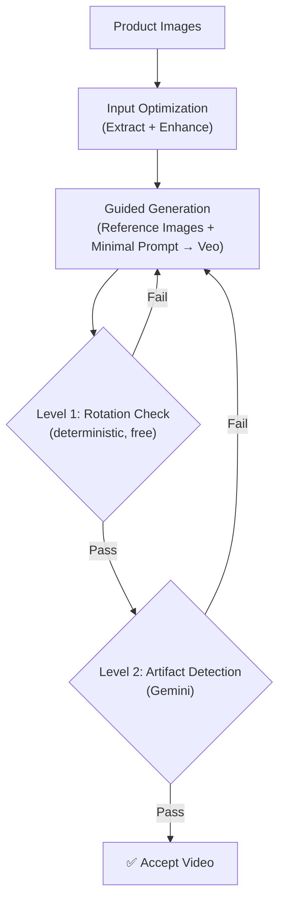

# Part 5: Case Study — Product 360 Spinning

> **[Back to Overview](genmedia_at_scale_main.md)** | **Previous: [Part 4 — Deep Dive: Evaluation](genmedia_at_scale_evaluation.md)**

---

## The Use Case

Product 360-degree spinning videos are one of the highest-impact media types in e-commerce. They let shoppers view a product from every angle, dramatically increasing purchase confidence and reducing returns.

Traditionally, creating a 360 spin requires a motorized turntable, controlled lighting, and a camera capturing dozens of frames per rotation — followed by post-production stitching. This costs $100–500+ per product and limits coverage to high-value SKUs.

The generative approach: take a small number of static product photographs and generate a smooth, continuous 360-degree spinning video using a video generation model (Veo) with reference-image conditioning. No turntable, no studio, no post-production.

This section walks through how the three-pillar framework applies to generic product spinning (mugs, backpacks, electronics, watches, etc.). The specialized footwear pipeline is covered in **[Part 6](genmedia_at_scale_spinning_shoes.md)**.

---

## Applying the Framework

### Pillar 1: Input Optimization

The pipeline accepts multiple product images and applies the input optimization toolkit:

- **Extraction:** Each image is segmented to isolate the product and place it on a clean, uniform background. This prevents the generation model from reproducing or reacting to studio backgrounds, gradients, or clutter.
- **Enhancement:** Images are upscaled to provide the generation model with maximum visual detail. Higher-resolution references produce sharper, more faithful video output.

For generic products, classification and selection use pretrained models like Gemini to identify usable images, filter out unsuitable ones, and select the best references for generation.

### Pillar 2: Guided Generation

The generation follows the framework's core principle: **reference images lead, descriptions are minimal.**

The model receives:
- Reference image canvases showing the product from different angles
- A short text prompt describing the action (e.g., "a continuous 360-degree orbit") and scene (e.g., "a white studio void")
- A brief subject description (e.g., "a red ceramic mug") generated by Gemini — just the product type and primary color, nothing more

The text prompt describes the *scene and motion*, never the product details. Product details come from the images. This minimizes the chance of text-image conflicts that lead to artifacts.

**Example Veo prompt:**

```
[Subject]: A red ceramic mug standing still in a completely white studio void
(Hex: #FFFFFF, RGB: 255, 255, 255).

[Action]: The camera performs one continuous, seamless, very fast 360-degree orbit
around the stationary product. The camera movement is perfectly smooth and steady,
maintaining a constant distance and speed throughout the entire clip. The product
does not move or rotate; only the camera moves.

[Scene]: A completely white studio void (Hex: #FFFFFF, RGB: 255, 255, 255).
The only visible element is the product, nothing else.
```

Notice how the prompt says nothing about the mug's handle, glaze, or any detail — it only describes the type, the camera motion, and the environment. The reference images carry everything else.

### Pillar 3: Automated Evaluation

Every generated video passes through a **two-level validation** that applies the cost-aware sequencing principle from the evaluation framework.

---

## Two-Level Validation

The key architectural pattern in this pipeline is layered evaluation: a cheap deterministic check first, then an expensive semantic check only if the first passes.

### Level 1: Rotation Direction (Deterministic)

The first check uses **motion tracking** to determine whether the video shows the expected rotation direction. It tracks visual features across consecutive frames, measures how they move horizontally, and classifies the overall motion as clockwise, anticlockwise, or invalid. This is a pure computer vision approach — no API calls, no cost, sub-second execution.

> **Why not use an LLM for this?** Rotation direction is an objective, measurable property. A deterministic algorithm is faster, cheaper, and more reproducible. Beyond cost, LLMs are often not well suited for reasoning across frames about precise spatial properties like position, direction, or specific movements — they excel at semantic understanding, not pixel-level measurement.

### Level 2: Visual Artifact Detection (Gemini)

Videos that pass the rotation check proceed to **semantic artifact detection** using Gemini as a vision evaluator.

Gemini evaluates the video for problems that optical flow can't catch:

| Detect (INVALID) | Accept (VALID) |
|-------------------|----------------|
| Hallucinated features (extra buttons, missing elements) | Minor wobbles or hesitations |
| Text/logos appearing mirrored or duplicated | Slight lighting variations |
| Product appearance changing mid-video | Natural reflections and shadows |
| Unnatural transformations or morphing | Minor surface imperfections |

The prompt calibration — distinguishing real defects from acceptable artifacts — is critical. Too strict and the pipeline wastes compute rejecting usable output. Too lenient and defective videos reach the catalog.

### The Retry Loop

If either validation level fails, the video is regenerated within a bounded retry budget.
If the retry budget is exhausted, the pipeline can either use the best available result (best-effort) or skip the product entirely (strict), depending on quality requirements.



---

## Conclusion

The generic spinning pipeline demonstrates the framework at its simplest: clean the inputs, keep the prompt minimal, and let layered evaluation — cheap deterministic checks first, semantic judgment second — turn a non-deterministic generation model into a reliable production system. When a product category demands deeper control, the same architecture extends naturally — as the footwear case study shows next.

---

> **Next: [Part 6 — Case Study: Footwear Spinning](genmedia_at_scale_spinning_shoes.md)**
