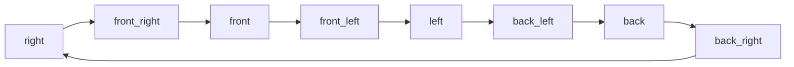

# Part 6: Case Study — Footwear Spinning

> **[Back to Overview](genmedia_at_scale_main.md)** | **Previous: [Part 5 — Case Study: Product 360 Spinning](genmedia_at_scale_spinning.md)**

---

## Why Shoes Are Harder

Footwear is one of the most challenging product categories for AI-generated spinning videos. Where a generic product (a mug, a backpack) has few well-defined viewpoints, a shoe has a highly structured geometry with **distinct, named views** — right side, left side, front, back, sole, top — that customers know and expect to see.

This creates problems that don't exist for generic products:

**1. Pair ambiguity.** Product photos frequently show two shoes together. The generation model needs a single shoe to spin, which means the pipeline must detect pairs and split them into individual shoe images.

**2. Viewpoint coverage requirements.** A spinning video must show the shoe from all angles. If the input images only cover the right side and front, the model must hallucinate what the back and left side look like — and it will often get it wrong (mirroring logos, inventing stitching patterns). The pipeline needs to verify that input images cover all cardinal viewpoints before attempting generation.

**3. Rotation verifiability.** Because shoes have named viewpoints, the pipeline can do something impossible with generic products: verify that the generated video actually passes through the correct sequence of views. A clockwise rotation should show: right → front → left → back → right. This enables **semantic spin validation** — a much stronger quality check than motion tracking alone.

---

## How the Framework Applies

The footwear pipeline demonstrates the full power of the three-pillar framework. Every technique in the toolkit is used, and the evaluation strategy combines multiple methods.

### Input Optimization: Classification-Driven

Unlike generic products, footwear requires **deep classification** before any processing begins.

**Viewpoint classification.** Catalog images arrive unlabeled and vary widely — you might get clean side views, but also intermediate angles (front_right, back_left), cropped close-ups, zoomed-in details, images of someone wearing the shoes, or sole views. Every input image is classified by a fine-tuned model into categories covering cardinal views (right, left, front, back), compound views (front_right, back_left, etc.), and special categories (sole, multiple shoes, invalid). Invalid images — cropped, zoomed, worn by a person, showing the sole — are discarded before any expensive processing.

**Pair splitting.** Images containing two shoes are automatically detected through classification and split into individual shoe images using segmentation. The resulting images are re-classified to determine their viewpoints.

**Feasibility check.** After classification, the pipeline verifies that the input set covers all four cardinal views (front, back, left, right) — compound views count toward their components (e.g., front_right covers both front and right). If coverage is insufficient, the product is excluded before any expensive processing occurs — a direct application of the fail-fast principle.

**Selection and ordering.** From the classified images, the pipeline selects the best images and orders them to match the clockwise rotation path. When multiple images cover the same viewpoint, the most complete one is selected. This gives the generation model the strongest possible visual references in the right sequence.

### Guided Generation

Same principle as generic spinning: reference images lead, descriptions are minimal. The prompt structure is identical — subject, action, scene — with only the subject description adapted for footwear.

**Example Veo prompt:**

```
[Subject]: A blue running shoe standing still in a completely white studio void
(Hex: #FFFFFF, RGB: 255, 255, 255).

[Action]: The camera performs one continuous, seamless, very fast 360-degree orbit
around the stationary product. The camera movement is perfectly smooth and steady,
maintaining a constant distance and speed throughout the entire clip. The product
does not move or rotate; only the camera moves.

[Scene]: A completely white studio void (Hex: #FFFFFF, RGB: 255, 255, 255).
The only visible element is the product, nothing else.
```

The prompt says nothing about the shoe's materials, stitching, or branding — all of that comes from the reference images.

### Automated Evaluation: Multi-Layer

This is where the footwear pipeline diverges most from the generic version. Instead of motion tracking + artifact detection, it uses **three layers of evaluation**, each catching a different class of problem.

---

## Semantic Spin Validation

This is the **core differentiator** of the footwear pipeline. Instead of measuring motion direction, it validates the spin by **classifying every sampled frame** and checking that the sequence follows a valid rotation path.

### The Rotation Graph

The valid clockwise rotation is defined as a directed graph:

```
right → front_right → front → front_left → left → back_left → back → back_right → right
```



### How It Works

1. **Frame sampling:** Frames are sampled from the video at a reduced rate
2. **Frame classification:** Each sampled frame is classified using the shoe classifier in "validation" mode — a simplified set of categories excluding views that shouldn't appear in a proper spinning video (sole, multiple, etc.)
3. **Coverage check:** All 8 positions must appear in the classified frames. Missing positions indicate an incomplete rotation.
4. **Path validation:** The sequence of classifications is checked against the rotation graph, with tolerance for noise (individual misclassifications, oscillations at transition boundaries, skipped intermediate views)

### Direction Detection

If the clockwise path check fails, the **reversed sequence** is checked. If the video is valid anticlockwise, the frames are reversed to produce clockwise output — the video is saved, not discarded.

### Completeness Check

The pipeline also verifies that the video represents a **full 360-degree rotation**. If the video went past 360°, it's trimmed to exactly one rotation. If it's incomplete, it's flagged as invalid.

---

## Product Consistency Validation

After spin validation passes, a second evaluation checks whether the **generated product matches the reference images** — detecting cases where the model hallucinated details, changed colors, or altered the shoe's structure.

The pipeline uses the **multi-view ground truth comparison** pattern from the evaluation framework: generated frames are matched to reference images by their classified viewpoint, and Gemini evaluates consistency across all views in a single call.

The evaluation criteria distinguish between strict and lenient checks:

| Strict (Must Match) | Lenient (Can Vary) |
|---------------------|-------------------|
| Feature placement (buckles, straps, eyelets) | Text legibility and spelling |
| Structural integrity (sole shape, heel height) | Logo fine detail |
| Color consistency across views | Minor angle differences |
| Hallucinated or missing features | Generative artifacts (slight texture variation) |

> **Key Principle:** Text and logos are treated as "visual blobs." Correct position and approximate color is sufficient — exact text rendering is not required.

If product consistency fails, the entire video generation is retried within the retry budget.

---

## Frame Post-Processing

Once a video passes all validation layers, the frames are post-processed for final output:

- **Reordering:** The sequence is adjusted to start from a consistent viewpoint, matched to the closest reference image
- **Cropping and resizing:** Product bounds are detected across all frames and a uniform crop is applied, producing consistent framing throughout the rotation

The final output includes both the video and a set of sampled frames suitable for interactive 360 viewers on product pages.

---

## Key Differences from Generic Spinning

| Aspect | Generic Pipeline | Footwear Pipeline |
|--------|-----------------|-------------------|
| **Classification** | Pretrained model (Gemini) | Fine-tuned viewpoint classifier |
| **Pair handling** | Not needed | Automatic detection and splitting |
| **Feasibility check** | Basic | 4-view coverage required |
| **Image selection** | Basic selection | Best views in clockwise order |
| **Spin validation** | Motion tracking (deterministic) | Frame-by-frame classification (semantic) |
| **Product consistency** | Artifact detection (Gemini) | Multi-view ground truth comparison (Gemini) |
| **Post-processing** | Minimal | Reorder + crop + resize |

---

## Framework Patterns Demonstrated

The footwear pipeline demonstrates how the framework scales to complex use cases by composing more techniques from the toolkit:

1. **Classification as routing** — viewpoint classification drives every downstream decision
2. **Fail-fast with feasibility checks** — insufficient inputs are caught before expensive processing
3. **Invalid input filtering** — unusable images (cropped, worn, sole views) are discarded before expensive processing
4. **Semantic evaluation** — domain knowledge (the rotation graph) enables stronger validation than generic approaches
5. **Multi-view ground truth comparison** — reference-matched evaluation catches hallucinations
6. **Layered evaluation** — each layer catches a different class of problem, and together they enable fully automated output

---

> **[Back to Overview](genmedia_at_scale_main.md)**
